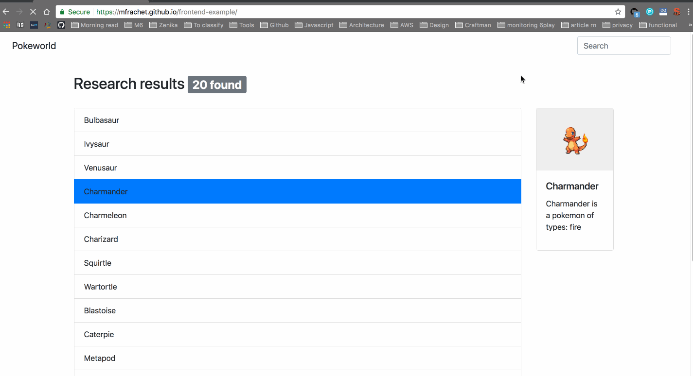

---

# What I can expect from this?

This exercice will make you create this little app. Click on the label to see the transformation appear:

<iframe src="https://codesandbox.io/embed/5zjpv8zl8p" style="width:100%; height:500px; border:0; border-radius: 4px; overflow:hidden;" sandbox="allow-modals allow-forms allow-popups allow-scripts allow-same-origin"></iframe>

It's a really simple app, but check what I've built with the approach presented in this tutorial:

It's available here: [https://mfrachet.github.io/frontend-example/](https://mfrachet.github.io/frontend-example/)
